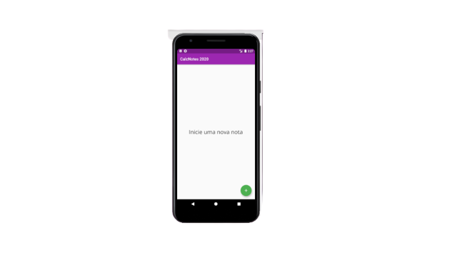
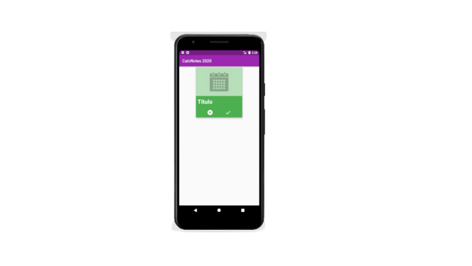
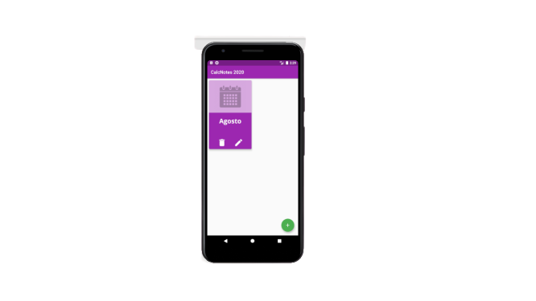
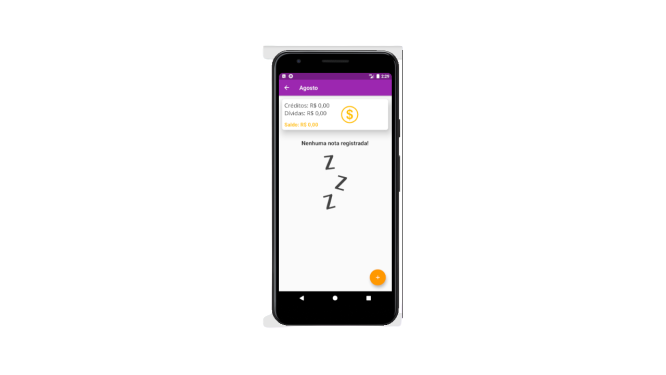
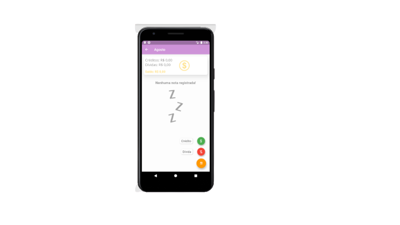
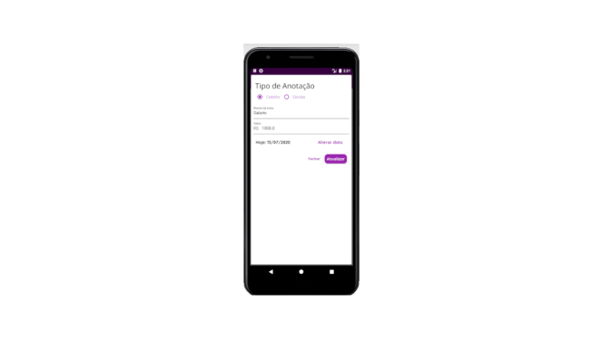
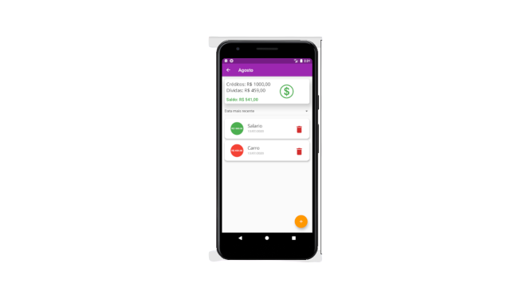

# Calc Note

Um aplicativo para fazer anotações de gastos e créditos. Sempre que realizar um gasto você pode anotar nesse Bloco de Notas inserindo nome do gasto e seu valor e o Calc Note irá totalizar sem que você precise usar calculadora. O mesmo acontece quando você adiciona um crédito. 
O app mostra o total de créditos e o total de dívidas e ainda mostra um agregado desses valores mostrando se você tem mais créditos ou mais dívidas.

<ul>
    <li></li>
    <li></li>
    <li></li>
    <li></li>
    <li></li>
    <li></li>
    <li></li>
</ul>

## Iniciando

Este projeto é um ponto de partida para um aplicativo Flutter.

Alguns recursos para você começar se este for seu primeiro projeto Flutter:

Laboratório: escreva seu primeiro aplicativo Flutter
Livro de receitas: Amostras úteis de flutter
Para obter ajuda sobre como iniciar o Flutter, consulte nossa documentação on-line , que oferece tutoriais, exemplos, orientações sobre desenvolvimento para dispositivos móveis e uma referência completa da API.

